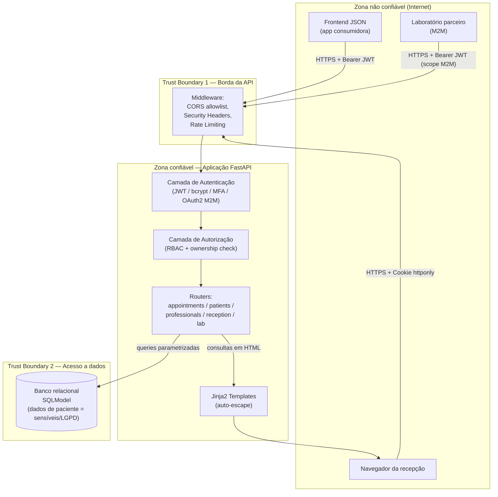

# Exercício 3 — Fundamentos de segurança e modelagem inicial

## 1. Análise sob a tríade CIA

Dado de saúde tem peso regulatório adicional sob a LGPD (art. 5º, II — dado
sensível), então a confidencialidade recebe prioridade sobre disponibilidade
sempre que as duas entram em conflito de design (ex.: preferimos negar uma
requisição ambígua de autorização a arriscar vazamento, mesmo que isso
signifique uma falha 404/403 legítima ocasional).

| Propriedade | O que significa aqui | Controles já implementados |
|---|---|---|
| **Confidencialidade** | Dados de paciente e prontuário só visíveis a quem tem necessidade legítima de acesso | `response_model` controlando campos expostos (`AppointmentRead`, `PatientRead`); RBAC + ownership check (`verify_appointment_ownership`); JWT com expiração de 15 min; MFA obrigatório para admin; CORS allowlist; HTTPS forçado via HSTS |
| **Integridade** | Nenhum dado de consulta/paciente pode ser alterado por quem não tem autorização, nem por injeção de campos não previstos | Ownership check bloqueia updates cruzados (BOLA); `extra='forbid'` em todo schema de entrada; queries sempre parametrizadas via SQLModel (sem concatenação de string); `professional_id` do token sobrepõe qualquer valor enviado pelo cliente na criação de consulta |
| **Disponibilidade** | A API precisa seguir respondendo mesmo sob tentativa de abuso (ex.: força bruta de login) | Rate limiting diferenciado em `/auth/token` (5/min); rate limit global (100/min); tokens de curta duração reduzem a janela de um token comprometido, mas não derrubam disponibilidade de sessões legítimas |

## 2. Mapeamento de frameworks de referência a controles concretos

| Framework | Categoria/controle | Onde está implementado |
|---|---|---|
| **OWASP ASVS / API Security Top 10** | API1:2023 BOLA | `app/security/permissions.py::verify_appointment_ownership` |
| | API2:2023 Broken Authentication | `app/security/auth.py` — bcrypt, JWT, MFA (TOTP) |
| | API3:2023 Broken Object Property Level Authorization | `AppointmentRead`/`PatientRead` como allowlist de campos + `extra='forbid'` na entrada |
| | API8:2023 Security Misconfiguration | CORS allowlist explícita, headers de segurança (`app/security/headers.py`) |
| **NIST SSDF (SP 800-218)** | PW.4 (revisar e/ou analisar o código-fonte) | Exercício 8 (análise manual de vulnerabilidades) |
| | PW.5 (configurar ferramentas de compilação/build para segurança) | Pipeline GitHub Actions (Exercício 12) com SAST/dependência |
| | RV.1 (identificar e confirmar vulnerabilidades) | Threat model (Exercício 4) + scan OWASP ZAP (Exercício 13) |
| **MITRE ATT&CK / CAPEC** | CAPEC-115 (Authentication Bypass) | JWT com `exp` + verificação de `is_active` |
| | CAPEC-664 (Server-Side Request Forgery) — mitigado preventivamente | Nenhum endpoint aceita URL arbitrária para fetch server-side |

## 3. DFD — Data Flow Diagram

**Trust boundaries identificadas:**
1. **Borda da API (internet → aplicação):** todo tráfego cruza HTTPS,
   passa por CORS allowlist e rate limiting antes de qualquer lógica de
   negócio rodar.
2. **Borda de autenticação → autorização:** um JWT válido não implica
   acesso a um recurso específico — a verificação de ownership é uma
   segunda porta, não uma consequência automática da primeira.
3. **Aplicação → banco de dados:** todo acesso passa por SQLModel
   (nunca SQL cru montado por concatenação), e a sessão de banco é
   injetada por request (sem estado compartilhado entre requisições).

**Fluxo de dado sensível de maior risco:** paciente → recepcionista
(cadastro) → banco → profissional (consulta) → template HTML (agenda) →
navegador da recepção. Cada seta desse fluxo tem um controle dedicado
(validação de entrada, RBAC, parametrização de query, auto-escape de
saída) — não existe um único ponto cuja falha exponha o dado inteiro.
